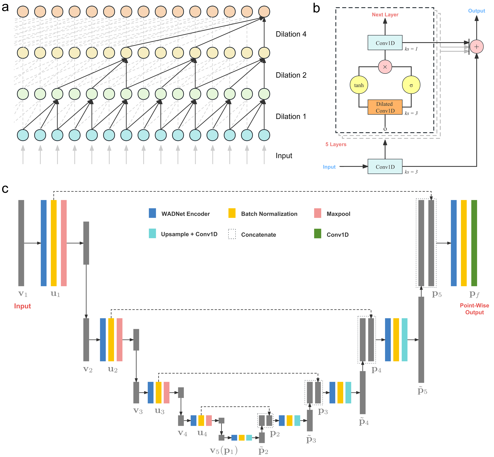

# U-AnDi

Supporting Codes of U-AnDi for data generation and model training

### Semantic Segmentation of Anomalous Diffusion Using Deep Convolutional Networks

#### Xiang Qu, Yi Hu, Wenjie Cai, Yang Xu, Hu Ke, Guolong Zhu, and [Zihan Huang](https://grzy.hnu.edu.cn/site/index/huangzihan)

School of Physics and Electronics, Hunan University, Changsha 410082, China

E-mail: huangzih@hnu.edu.cn

\


>**Note**: For code files in this repository:
> * The suffix `reg`, `cls`, and `exp` correspond to subtask1, subtask2, and experimental data, respectively. 

### 1. Data Generation

```python
# Generation
python generate_data_reg.py --l 500 --N 1000000

# Pre-Processing for training
python pre_process_data_reg.py --l 500
```
*l* is the length, *N* is the number of trajectories.

The version of [*andi-datasets*](https://github.com/AnDiChallenge/andi_datasets) is 2.0.0 in subtask 1, and 0.0.5 in subtask 2 and experimental data.

### 2. Model Training

```python
python train-U-AnDi-reg.py --l 500
```

#### Environment:
* OS: Ubuntu 16.04
* GPU: NVIDIA A100 40G
* Python==3.7.4
* PyTorch==1.12.1
* cuda==11.6
